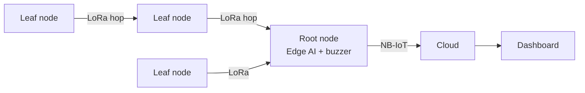

# SIH-26178 ENVORA
### ENVironmental Observation, Response & Analytics

    

ENVORA is a distributed environmental intelligence network for detecting floods, forest fires,
air pollution and other hazards. Battery-powered **leaf nodes** sense and relay data over LoRa.
One **NB-IoT root node** per area runs edge AI, triggers local alerts and keeps a live dashboard updated.

Built for Smart India Hackathon 2026, Problem Statement **26178** (Qualcomm Inc, Disaster Management).

## Live links
- Website / dashboard: [WEBSITE_URL]
- 3D view of the root node PCB: [3D_PCB_URL]
- Demo video: [DEMO_VIDEO_URL]

## Problem
Hazards such as floods, forest fires and pollution spikes are often detected late because monitoring
infrastructure is sparse, power-hungry, or relies on connectivity that fails during a disaster.
[Add 2-3 lines from the official problem statement.]

## Solution
- **Leaf nodes**: sensors + SX1276 LoRa. They sample, sleep, and relay (hop) packets toward the root. No cellular modem on leaf nodes.
- **Root node** (one per area): ESP32 + SX1276 LoRa (receives all leaf traffic) + Quectel BG95-M3 NB-IoT modem (cloud uplink) + buzzer (local alert). Runs edge AI on incoming data.
- **Dashboard**: live view of conditions and alerts across the monitored area.

Why one modem per area: it removes SIM/modem power drain from every node, keeping leaf nodes cheap and long-lived.

## Architecture

More detail in [docs/architecture.md](docs/architecture.md).

## Hardware
| | Leaf node | Root node |
|---|---|---|
| MCU | TODO (open item) | ESP32-WROOM |
| LoRa | SX1276 | SX1276 |
| Cellular | none | Quectel BG95-M3 (NB-IoT), SIM slot |
| Power | TODO (battery sized for relaying) | 18650 (BT1), USB-C + solar charging (CN3065, FS8205A protection) |
| Local alert | - | Buzzer |

Root node PCB sections: Microcontroller Unit, LoRa Wireless, Cellular NB-IoT, Power Management, Local Alerting.
See [hardware/root-node/README.md](hardware/root-node/README.md).

## Repository layout
```
docs/       design docs, protocol, power budget, BOM
hardware/   root-node and leaf-node schematics, PCB, 3D, BOM
firmware/   common packet code, leaf-node and root-node PlatformIO projects
edge-ai/    training scripts, models, optional alert-text model
tools/      packet codec and sensor simulator (no hardware needed)
tests/      unit tests
website/    dashboard / project website
```

## Getting started
### Test the protocol without hardware
```bash
pip install pytest
python -m pytest tests
python tools/sensor_simulator.py --nodes 3 --count 5
```
### Firmware
1. Install [PlatformIO](https://platformio.org/).
2. Copy `firmware/root-node/include/secrets.example.h` to `secrets.h` and fill in APN / MQTT details.
3. Build and flash:
```bash
cd firmware/leaf-node && pio run -t upload
cd firmware/root-node && pio run -t upload
```
Pin mappings in `include/config.h` are placeholders. Set them from your schematic.
### Edge AI
```bash
cd edge-ai/training && pip install -r requirements.txt && python train_classifier.py
```
### Website
See [website/README.md](website/README.md).

## Expected Solution checklist
Fill in each point from the problem statement and link to where it is implemented.
- [ ] TODO point 1 -> file / feature
- [ ] TODO point 2 -> file / feature

## Roadmap
- [ ] Finalize leaf node MCU and power design
- [ ] Real sensor drivers on leaf node
- [ ] Validate BG95 uplink on hardware
- [ ] Deploy trained edge model on root node
- [ ] Optional: tiny char-level RNN to turn alert packets into readable text

## Team
| Name | Role |
|---|---|
| TODO | TODO |

## License
Software: MIT. Hardware designs: CERN-OHL-P-2.0 (see [LICENSE](LICENSE)).
