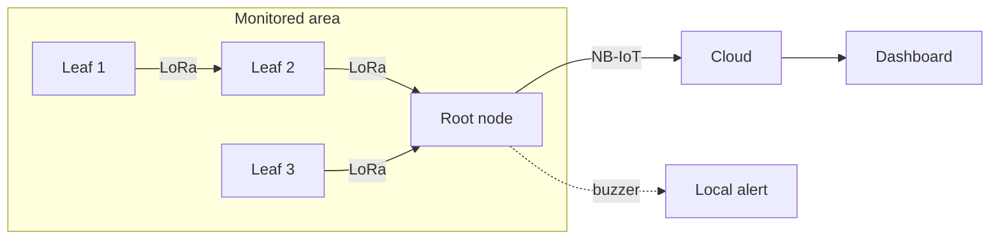

# Architecture

## Roles
- **Leaf node:** samples sensors, transmits over LoRa, briefly listens and relays packets from neighbours, then deep-sleeps. No cellular modem.
- **Root node:** single gateway per area. Receives LoRa, validates packets, runs alert logic / edge AI, sounds a buzzer, and uploads over NB-IoT.
- **Cloud + dashboard:** stores readings and shows live status and alerts.

## Design decisions
| Decision | Reason |
|---|---|
| One NB-IoT modem per area, not per node | Avoids SIM/modem power drain on every node |
| Multi-hop LoRa relaying | Extends range without a modem per node |
| CR1220 coin cell replaced by 18650 | Relaying means frequent LoRa RX, which drains a coin cell quickly |
| USB-C + solar charging on root | Works off-grid and can be bench-charged |
| Edge AI at root | Alerts can be raised locally even when the uplink is slow |

## Data flow
1. Leaf wakes, reads sensors, builds a packet (see [lora-mesh-protocol.md](lora-mesh-protocol.md)).
2. Packet is transmitted, then the leaf listens for a short window and relays new packets (TTL permitting).
3. Root receives, checks CRC, drops duplicates, evaluates alert logic.
4. Root publishes JSON over NB-IoT to the cloud; dashboard updates.
